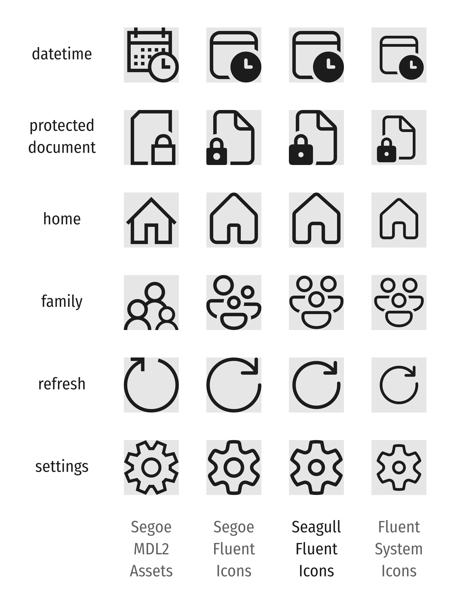
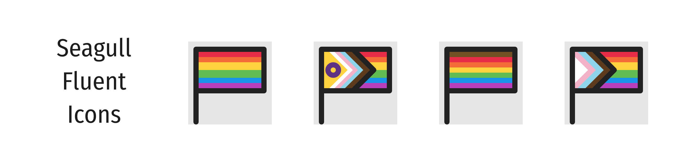

# Seagull Fluent Icons

Seagull Icons is a modified icon set based on [fluentui-system-icons](https://github.com/microsoft/fluentui-system-icons). It provides similar appearance to [Segoe MDL2 Assets](https://learn.microsoft.com/en-us/windows/apps/design/style/segoe-ui-symbol-font) and [Segoe Fluent Icons](https://learn.microsoft.com/en-us/windows/apps/design/style/segoe-fluent-icons-font), and displays color icons properly by using COLR/CPAL format.

